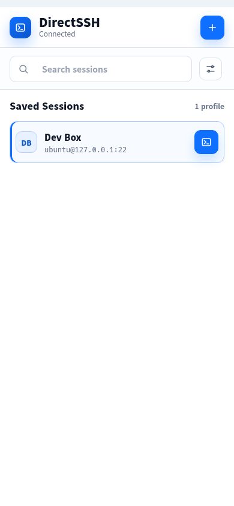
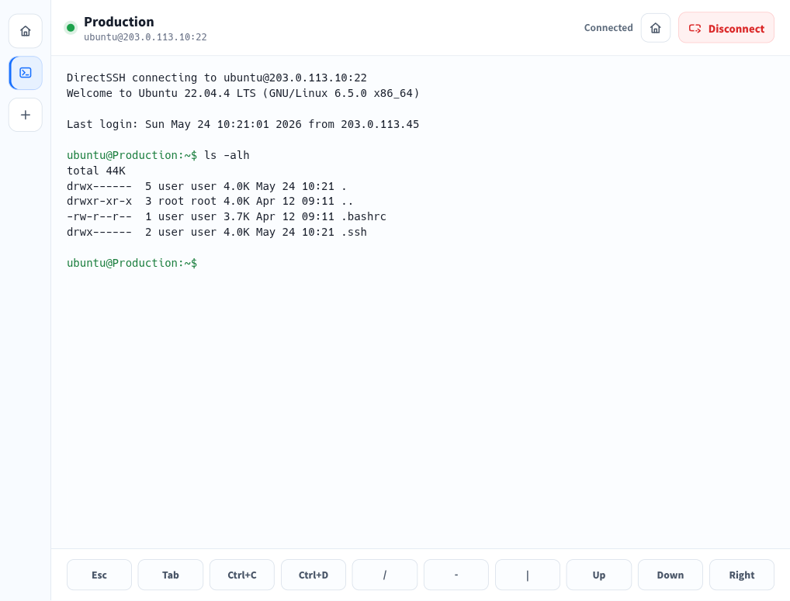

<p align="center">
  
</p>

<h1 align="center">DirectSSH</h1>

<p align="center">
  A standalone mobile-first SSH terminal client built with Slint and Rust.
</p>

<p align="center">
  <a href="https://github.com/smturtle2/DirectSSH/releases/latest"></a>
  <a href="https://github.com/smturtle2/DirectSSH/blob/main/LICENSE"></a>
  
  
</p>

## Highlights

- Native Slint UI with separate HOME session manager and SSH terminal screens.
- Direct SSH sockets through Rust `russh`; no cloud relay or browser pseudo terminal.
- Password and private-key authentication with reusable saved profiles.
- Local AES-GCM encrypted profile vault in the app data directory.
- VT100 terminal parser with PTY resize, shortcut keys, and terminal font-size controls.
- Light mobile-first layout with compact sessions, portrait top tabs, and wide rotated rail tabs.

## Screenshots

| Session manager | SSH terminal |
| --- | --- |
|  |  |

## Install

Download the latest APK from the GitHub Releases page:

```text
https://github.com/smturtle2/DirectSSH/releases/latest
```

If Android blocks the download source, enable installation from that browser or file manager in system settings.

## Development

Prerequisites:

- Rust 1.88 or newer
- Android SDK, Android NDK, and JDK 17 for Android builds
- `cargo-apk` or `xbuild` for Android packaging

Run the desktop development build:

```bash
cargo run
```

Check and format the Rust code:

```bash
cargo fmt --check
cargo check
cargo clippy --all-targets -- -D warnings
```

Build a release Android APK with `cargo-apk`. The APK must be signed; keep the keystore outside the repository and pass it through environment variables:

```bash
export JAVA_HOME=/usr/lib/jvm/java-17-openjdk
export ANDROID_HOME="$HOME/Android/Sdk"
export ANDROID_NDK_ROOT="$HOME/Android/Sdk/ndk/28.2.13676358"
export CARGO_APK_RELEASE_KEYSTORE="$HOME/.android/directssh-release.keystore"
export CARGO_APK_RELEASE_KEYSTORE_PASSWORD="$(cat "$HOME/.android/directssh-release.keystore.pass")"

cargo apk build --target aarch64-linux-android --lib --release
```

Install on a connected Android device:

```bash
cargo apk run --target aarch64-linux-android --lib
```

## Security Notes

DirectSSH stores saved profiles in an AES-GCM encrypted vault under the app data directory and protects the local vault key with `0600` permissions on Unix-like platforms.

This is an early native rewrite. SSH server host-key pinning/known-hosts verification is not implemented yet; the current backend accepts the server key during connection. Use trusted hosts and networks until host-key verification is added.

## Tech Stack

- Slint
- Rust
- russh
- vt100
- AES-GCM

## License

MIT
