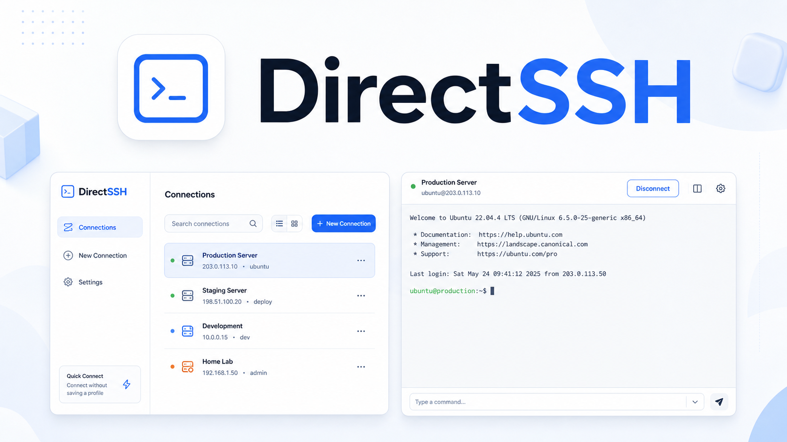

<p align="center">
  
</p>

<h1 align="center">DirectSSH</h1>

<p align="center">
  A standalone mobile-first SSH terminal client built with Tauri, Rust, TypeScript, and xterm.js.
</p>

<p align="center">
  <a href="https://github.com/smturtle2/DirectSSH/releases/latest"></a>
  <a href="https://github.com/smturtle2/DirectSSH/blob/main/LICENSE"></a>
  
  
</p>

## Highlights

- Direct SSH sockets through a native Rust backend. No cloud relay or browser-only pseudo terminal.
- Password and private-key authentication support through `russh`.
- xterm.js terminal with PTY resize, scrollback, shortcut keys, and mobile keyboard handling.
- Encrypted local profile vault using AES-GCM in the app data directory.
- Mobile-first layout with compact saved sessions, phone tabs, and tablet rail navigation.
- Browser preview mode with simulated SSH events for UI development.

## Screens

The app is designed around a compact session manager and a dark terminal workspace:

- Save reusable host profiles with password or key authentication.
- Connect from a saved profile or launch an ephemeral connection from the current form.
- Send terminal input directly to the active SSH PTY.
- Disconnect active sessions from the terminal toolbar.

## Install

Download the latest APK from the GitHub Releases page:

```text
https://github.com/smturtle2/DirectSSH/releases/latest
```

Use the signed `DirectSSH-v0.1.1.apk` asset for normal installation. If Android blocks the download source, enable installation from that browser or file manager in system settings.

## Development

Prerequisites:

- Node.js and npm
- Rust toolchain
- Android SDK, Android NDK, and JDK 17 for Android builds

Install dependencies:

```bash
npm install
```

Run the browser preview:

```bash
npm run dev -- --port 1420
```

Run type checking and build the frontend:

```bash
npm run build
```

Check the Rust backend:

```bash
cargo check --manifest-path src-tauri/Cargo.toml
```

Build an Android APK:

```bash
JAVA_HOME=/usr/lib/jvm/java-17-openjdk \
ANDROID_HOME="$HOME/Android/Sdk" \
ANDROID_SDK_ROOT="$HOME/Android/Sdk" \
PATH="$HOME/Android/Sdk/platform-tools:$HOME/Android/Sdk/cmdline-tools/latest/bin:$PATH" \
npm run tauri android build -- --apk
```

Build an installable debug APK:

```bash
JAVA_HOME=/usr/lib/jvm/java-17-openjdk \
ANDROID_HOME="$HOME/Android/Sdk" \
ANDROID_SDK_ROOT="$HOME/Android/Sdk" \
PATH="$HOME/Android/Sdk/platform-tools:$HOME/Android/Sdk/cmdline-tools/latest/bin:$PATH" \
npm run tauri android build -- --debug --apk
```

## Security Notes

DirectSSH stores saved profiles in an AES-GCM encrypted vault under the app data directory and protects the local vault key with `0600` permissions on Unix-like platforms.

This is an early MVP. SSH server host-key pinning/known-hosts verification is not implemented yet; the current backend accepts the server key during connection. Use trusted hosts and networks until host-key verification is added.

## Tech Stack

- Tauri 2
- Rust
- russh
- TypeScript
- Vite
- xterm.js

## License

MIT
